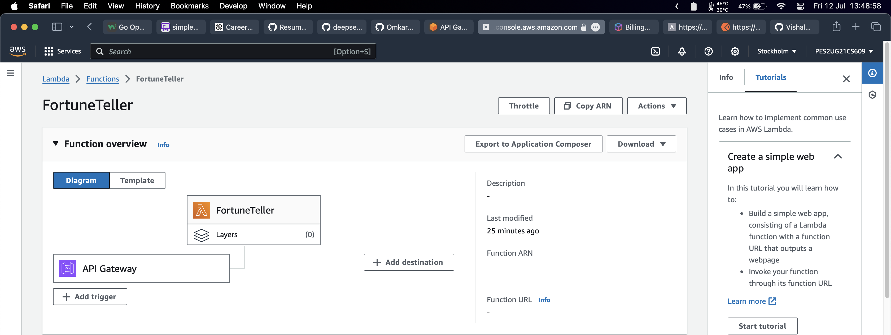
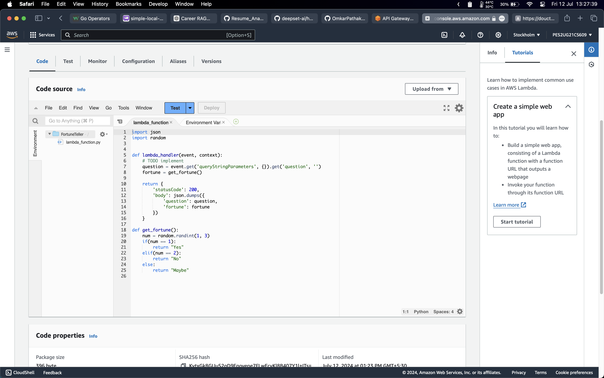
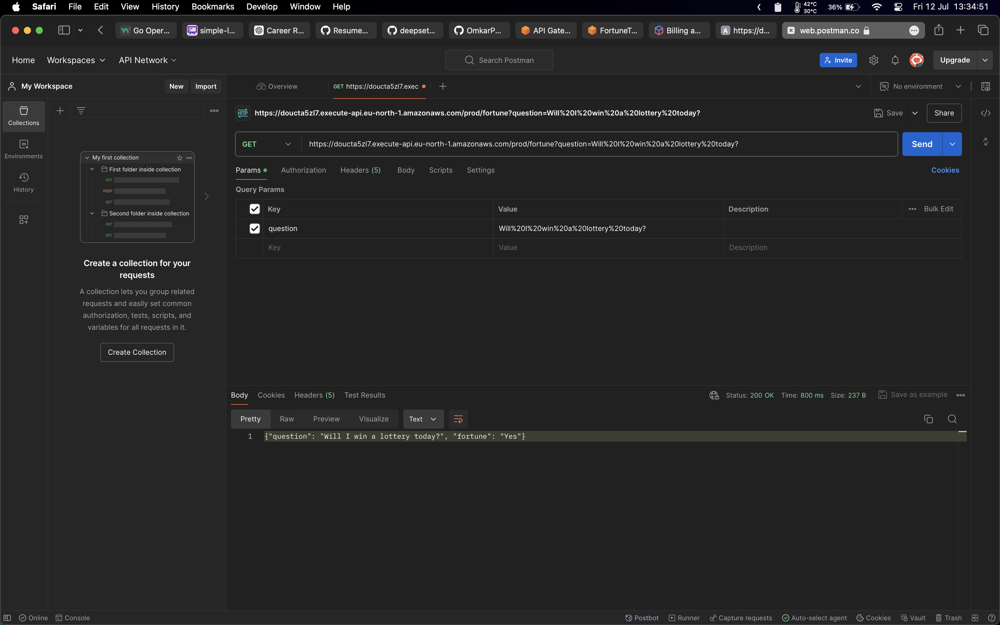
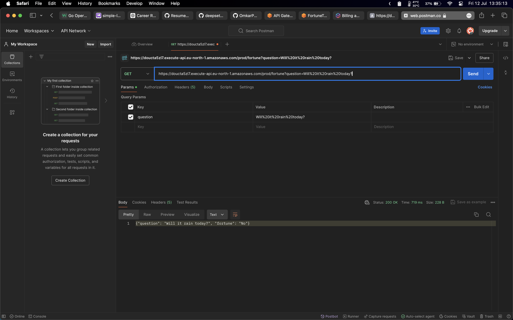

# Fortune Teller Application

This is a simple "Fortune Teller" application using AWS Lambda that answers "yes", "no", or "maybe" to user questions.

## Setup

1. Set up an AWS Lambda function with the provided `lambda_function.py` code.
2. Create an API Gateway to trigger the Lambda function.
3. Deploy the API Gateway and test the endpoint.

## Pictures

* Testing the endpoint on Postman

  

  
